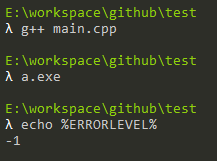

# 练习1.1

查阅你使用的编译器文档，确定它所使用的文件命名约定。编译并运行第2页的main程序。

```cpp
int main()
{
	return 0;
}
```


# 练习1.2

改写程序，让它返回`-1`。返回值`-1`通常被当做程序错误的标志。重新编译并运行你的程序，观察你的系统如何处理`main`返回的错误标识。

```cpp
int main()
{
	return -1;
}
```


