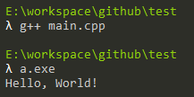
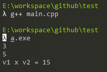
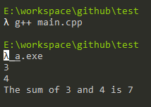
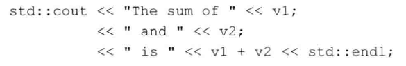

# 练习1.3

编写程序，在标准输出上打印Hello, World。

```cpp
#include <iostream>

int main()
{
	std::cout << "Hello, World!" << std::endl;
	return 0;
}
```



# 练习1.4

我们的程序使用加法运算符`+`来将两个数相加。编写程序使用乘法运算符`*`，来打印两个数的乘积。

```cpp
#include <iostream>

int main()
{
	int v1, v2;
	std::cin >> v1 >> v2;
	std::cout << "v1 x v2 = " << v1 * v2 << std::endl;
	return 0;
}
```



# 练习1.5

我们将左右输出操作放在一条很长的语句中。重写程序，将每个运算对象的打印操作放在一条独立的语句中。

```cpp
#include <iostream>

int main()
{
	int v1, v2;
	std::cin >> v1 >> v2;
	std::cout << "The sum of ";
	std::cout << v1;
	std::cout << " and ";
	std::cout << v2;
	std::cout << " is ";
	std::cout << v1 + v2;
	std::cout << std::endl;
	return 0;
}
```



# 练习1.6

解释下面程序片段是否合法。



不合法，第2,3条语句没有`<<`运算符的左操作数。应该在前面加上`std::cout`。
