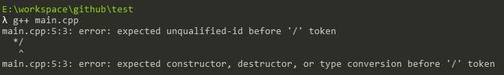
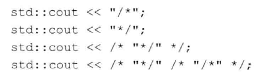
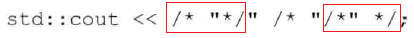

# 练习1.7

编译一个包含不正确的嵌套注释的程序，观察编译器返回的错误信息。

```
#include <iostream>

/*
 * 这是注释/*不正确的嵌套注释*/
 */
int main()
{
	std::cout << "Hello, world!" << std::endl;
	return 0;
}
```



# 练习1.8

指出下列哪些输出语句是合法的（如果有的话）：



1. 合法
2. 合法
3. 不合法，编译报错` error: expected primary-expression before ';' token`
4. 合法，打印` /* `，左右两个完整的注释标记注掉了双引号，中间是真正的字符串（真的会有人这么写么(╯‵□′)╯︵┻━┻）


