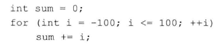
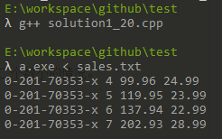
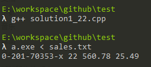

# 练习1.9~1.11

见C++源代码文件。

# 练习1.12

下面for循环完成了什么功能？sum的终值是多少？

计算`[-100, 100]`所有整数的和，终值为`0`。

## 练习1.13

见C++源代码文件。

## 练习1.14

对比for循环和while循环，两种形式的优缺点各是什么？

具体情况具体分析，没什么可比性。

## 练习1.15

编写程序，包含第14页“再探编译”中讨论的常见错误。熟悉编译器生成的错误信息。

略。

## 练习1.16

见C++源代码文件。

注：Windows下，输入结束使用`CTRL+Z`。

## 练习1.17~1.18

如果输入的所有值都是相等的，本节的程序会输出什么？如果没有重复值，输出又会是怎样的？

1. 输出只有一个，例如输入`1 1 1 1 1`，输出`1 occurs 5 times`
2. 输出每一个值都出现一次的情况

## 练习1.19

修改练习1.10，所编写的程序，使其能够处理用户输入的第一个数比第二个数小的情况。

注，`solution1_10.cpp`已经实现这个功能了。

## 练习1.20

编写一个程序，读取一组书籍的销售记录，将每条记录打印到标准输出上。

见C++源代码文件。

## 练习1.21~1.22

见C++源代码文件，`solution1_22.cpp`的功能包含练习1.21。

## 练习1.23~1.24

见C++源代码文件。

## 练习1.25

借助`Sales_item.h`头文件，编译并运行本节给出的书店程序。

略。
