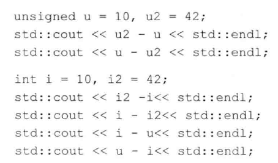
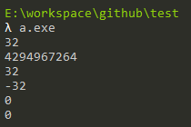
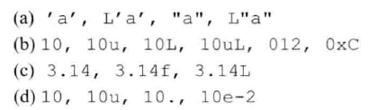
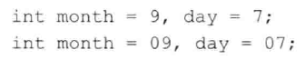

# 练习2.1

类型int、long、long long和short的区别是什么？无符号类型和带符号类型的区别是什么？float和double的区别是什么？

区别为这几种数据类型所占内存位的长度不一样，根据机器字长和不同的操作系统，同一个类型在不同环境下也可能不同。

有符号类型会多用1bit用来记录符号，因此可以出现负数。

float和double精度不同，一般我们都使用double，精度更高，计算更快，float在涉及到某些显卡等特定硬件时才会用到。

# 练习2.2

计算按揭贷款时，对于利率、本金和付款分别应选择何种数据类型？说明你的理由。

都应选择double，因为可能有小数，所有整数类型都不满足，float不考虑。

# 练习2.3~2.4

读程序写结果。

注：我使用MinGW编译的是32位程序，因此对于第二个结果，其实质是`2^32-32`。

# 练习2.5

指出下述字面值的数据类型并说明每一组内几种字面值的区别：

1. 字符，宽字符，字符串，宽字符串
2. 有符号整数，无符号整数，有符号长整数，无符号长整数，八进制数，十六进制数
3. 双精度浮点数，单精度浮点数，高精度浮点数
4. 有符号整数，无符号整数，双精度浮点数，双精度浮点数（科学计数法）

# 练习2.6

下面两组定义是否有区别，如果有，请叙述之：

有区别，`0`开头是八进制数，`09`是非法的字面值。

# 练习2.7

下述字面值表示何种含义？它们各自的数据类型是什么？

* (a) 字符串
* (b) 高精度浮点数（科学计数法表示）
* (c) 单精度浮点数
* (d) 高精度浮点数

# 练习2.8

见源代码文件。
