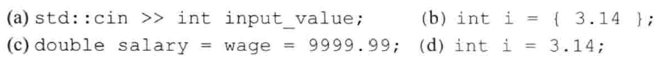
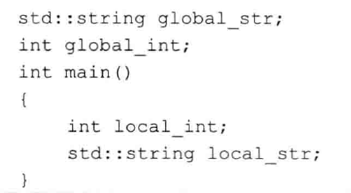
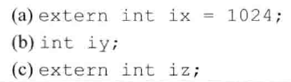
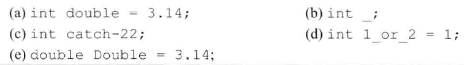
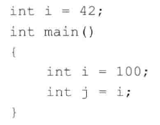
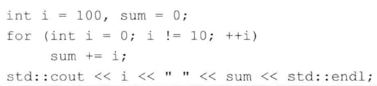

# 练习2.9

解释下列定义的含义。对于非法的定义，请说明错误在何处并将其改正。

1. 错误，先声明`input_value`，再用`cin`从标准输入读取值
2. 错误，列表初始化不能损失精度，会报错
3. 错误，wage类型未声明
4. 错误，虽然不报错但不能这样写，浮点数字面量初始化赋值给整型损失精度，字面量没有意义

# 练习2.10

下列变量的初始值分别是什么？

* `global_str`：空字符串
* `global_int`：0
* `local_int`：未定义
* `local_str`：空字符串

# 练习2.11

指出下面的语句是声明还是定义：

1. 定义
2. 定义
3. 声明

# 练习2.12

请指出下面的名字中哪些是非法的？

1. 非法，double是关键字
2. 正确，但是这个名字没有任何意义
3. 非法，变量名不能包含横线`-`
4. 非法，变量名不能是数字开头
5. 正确，但是这个名字很有歧义

# 练习2.13

下面程序中j的值是多少？

`j`的值为`100`。

# 练习2.14

下面程序合法吗？如果合法，它将输出什么？

合法，输出`100 45`。
