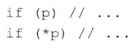
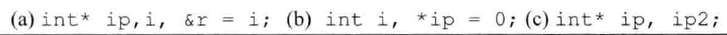

# 练习2.15

下面的哪个定义是不可法的？为什么？


1. 合法
2. 不合法，不能对字面值取引用
3. 合法
4. 引用必须初始化

# 练习2.16

考察下面的所有赋值然后回答：哪些赋值是不合法的？为什么？哪些赋值是合法的？它们执行了什么样的操作？


1. 合法，为`d`赋值
2. 合法，为`d`赋值
3. 合法，为`i`赋值
4. 合法，为`i`赋值

# 练习2.17

执行下面代码段将输出什么结果？


输出`10 10`。

# 练习2.18

见源代码文件。

# 练习2.19

说明指针和引用的主要区别。

* 指针：指针本身也是对象，保存的是指向对象的内存地址。
* 引用：引用本身不是对象，它只是一个变量名的别名。

# 练习2.20

请叙述下面这段代码的作用。


```
定义变量i，值为42
定义指针p1，指向i
对p1指向的对象赋值，值为它原来的二次方
```

# 练习2.21

请解释下述定义。在这些定义中有非法的吗？如果有，为什么？


1. 非法，不能将整型取地址赋值给双精度浮点型的指针
2. 非法，不能将`int`类型赋值给`int *`
3. 合法

# 练习2.22

假设p是一个`int`型指针，请说明下述代码的含义。



1. 判断`p`是否是空指针
2. 判断`p`指向的值是否是0

# 练习2.23

给定指针p，你能知道它是否指向了一个合法的对象吗？如果能，叙述判断的思路，如果不能，也请说明原因。

除非知道p指向对象中的确定的某些信息，否则不能。

# 练习2.24

在下面这段代码中为什么p合法而lp非法？


C++规定，不能让`long *`指向`int`类型，类型不同。而`void *`可以指向任何类型。

# 练习2.25

请说明下列变量的类型和值。



* (a)：ip是整型指针，i是整型，r是i的引用
* (b)：i是整型，ip是空指针
* (c)：ip是指针，ip2是整型
