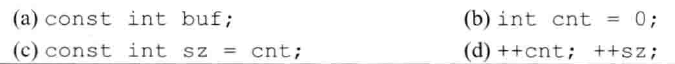
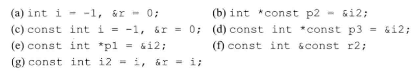
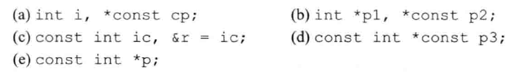
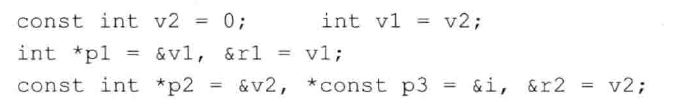
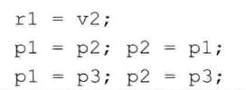
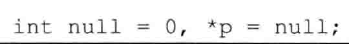

# 练习2.26

下面哪些句子是合法的？如果有不合法的句子，说明为什么？

1. 不合法，const不能只声明不初始化变量
2. 合法
3. 合法
4. 合法；不合法；第二个原因是静态变量不能修改其值

# 练习2.27

下面的哪些初始化是合法的？请说明原因。

1. 不合法，不能给字面量取引用
2. 合法
3. 合法
4. 合法
5. 如果i2是静态变量则合法
6. 不合法，引用不是对象，不能使用const修饰
7. 合法

# 练习2.28

说明下面的这些定义是什么意思，挑出其中不合法的。

1. 不合法，静态变量cp（指向整形的静态指针）必须初始化
2. 不合法，原因同上
3. 不合法，原因同上
4. 不合法，原因同上
5. 合法，p是指向整形静态变量的指针

# 练习2.29

假设已有上一个练习中定义的那些变量，则下面的哪些语句是合法的？请说明原因。

1. 合法
2. 不合法，p3指向静态变量，而p1不是
3. 不合法，ic是静态变量，不能取地址赋给指向非静态变量的指针
4. 不合法，这个题目不太明确，p3只能在其声明时初始化
5. 不合法，p2是静态的
6. 不合法，ic不能被赋值

# 练习2.30

对于下面的这些语句，请说明对象被声明成了顶层const还是底层const？

1. v2是顶层const
2. v1是变量
3. p1是指向变量的可变指针，r1是变量v1的引用
4. p2是底层const
5. p3是双层const
6. r2是底层const

# 练习2.31

假设已有上一个练习中所做的那些声明，则下面的哪些语句是合法的？请说明顶层const和底层const在每个例子中有何体现？

1. 合法，该语句使用静态变量为r1引用的对象赋值
2. `p1 = p2`不合法，p2有底层const而p1没有
3. `p1 = p3`不合法，理由同上

# 练习2.32

下面的代码是否合法？如果非法，请设法将其修改正确。

非法，修改为`*p = nullptr`。
