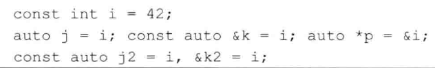
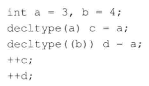
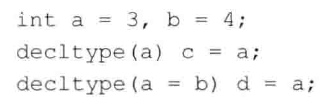

# 练习2.33

利用本节定义的变量，判断下列语句的运行结果。

1. a：a是整形变量
2. b：b是整形变量，`auto b = ci`忽略的顶层const
3. c：c是整形变量，`const int &cr = ci`即cr是`const int`引用，理由同上
4. d：错误，d是个指针，不能赋值`42`
5. e：错误，理由同上
6. g：错误，g是个整型常量的引用，不能对常量赋值

# 练习2.34

基于上一个练习中的变量和语句编写一段程序，输出赋值前后变量的内容，你刚才的推断正确吗？如果不对，请反复研读本节的示例，直到你明白错在何处为止。

略

# 练习2.35

判断下列定义推断出的类型是什么，然后编写程序进行验证。



1. i：整形常量
2. j：整形；k指向整形常量的引用；p指向整型常量的指针
3. j2：整形常量；k2指向整形常量的引用

# 练习2.36

关于下面的代码，请指出内一个变量的类型以及程序结束时它们各自的值。



类型：

a 整形 b 整形 c 整形 d 整形引用

结束值：

a 4 b 4 c 4 d 4

# 练习2.37

赋值是会产生引用的一类典型表达式，引用的类型就是左值的类型。也就是说，如果i是int，则表达式i=x的类型就是int&。根据这一特点，请指出下面的代码中每一个变量的类型和值。



```
a 整形 3
b 整形 4
c 整形 3
d 整形引用 3
```

# 练习2.38

请说明由decltype指定类型和由auto指定类型有何区别。请举出一个例子，decltype指定的类型与auto指定的类型一样；再举一个例子，decltype执行的类型与auto指定的类型不一样。

```cpp
int i = 0;
decltype(i) j = i;
auto((i)) k = i;
```
