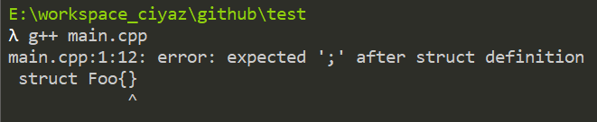

# 练习2.39

编译下面的程序观察其运行结果，注意，如果忘记写类定义体后面的分号会发生什么情况？记录下相关信息，以后可能会有用。

编译器直接提示我们忘记加分号了。

# 练习2.40-2.41

从数据库角度看，没有把“书”这个实体和“销售记录”杂糅在一起建表的，所以我把两个数据结构拆开了。

见源代码文件`solution2_40.cpp`。

# 练习2.42

根据你自己的理解重写一个Sales_data.h头文件，并以此为基础重做上一节的练习。

见源代码文件`solution2_41.cpp`和`model.h`。
