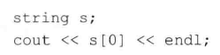
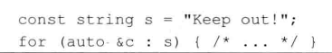

# 练习3.2

编写一个程序从标准输入中一次读入一整行，然后修改该程序使其一次读入一个词。

见源代码文件`solution3_2_1.cpp`和`solution3_2_2.cpp`。

# 练习3.3

请说明string类的输入运算符和getline函数分别是如何处理空白字符的。

输入运算符忽略开头换行符，识别所有空白字符作为一个输入，getline函数不忽略开头换行符，只识别换行符作为一个输入。

# 练习3.4

编写一个程序读入两个字符串，比较其是否相等并输出结果。如果不想等，输出较大的那个字符串。改写上述程序，比较输入的两个字符串是否等长，如果不等长，输出长度较大的那个字符串。

见源代码文件`solution3_4_1.cpp`和`solution3_4_2.cpp`。

# 练习3.5

编写一段程序从标准输入中读入多个字符串并将它们连接在一起，输出连接成的大字符串。然后修改上述程序，用空格把输入的多个字符串分隔开来。

见源代码文件`solution3_5.cpp`。

# 练习3.6

编写一段程序，使用范围for语句将字符串内的所有字符用X代替。

见源代码文件`solution3_6.cpp`。

# 练习3.7

就上一期完成的程序而言，如果将循环控制变量的类型设为char将发生什么？先估计一下结果，然后实际编程进行验证。

字符串的内容将不会改变，因为赋值的是新创建的char类型，而不是原来字符串中字符的引用。

# 练习3.8

分别用while循环和传统的for循环重写第一题的程序，你觉得哪种形式更好？为什么？

见源代码文件`solution3_8_1.cpp`和`solution3_8_2.cpp`。

# 练习3.9

下面的程序有何作用？它合法吗？如果不合法，为什么？

没有意义，字符串s未定义。

# 练习3.10

编写一段程序，读入一个包含标点符号的字符串，将标点符号去除后输出字符串剩余的部分。

见源代码文件`solution3_10.cpp`。

# 练习3.11

下面的范围for语句合法吗？如果合法，c的类型是什么？

合法，const char类型的引用。
