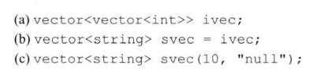

# 练习3.12

下列vector对象的定义有不正确的吗？如果有，请指出来。对于正确的，描述其执行结果；对于不正确的，说明其错误原因。

1. 正确
2. 不正确，vector类型不同
3. 正确，初始化包含十个字符串"null"的vector

# 练习3.13

下列vector对象各包含多少个元素？这些元素的值分别是多少？

0 10 10 1 2 10 10

# 练习3.14

编写一段程序，用cin读入一组整数并把它们存入一个vector对象。

见源代码文件`solution3_14.cpp`。

# 练习3.15

改写上题程序，不过这次读入的是字符串。

见源代码文件`solution3_15.cpp`。

# 练习3.16

编写一段程序，把练习3.13中vector对象的容量和具体内容输出出来。检验你之前的回答是否正确，如果不对，回过头重新学习3.3.1节直到弄明白错在何处为止。

见源代码文件`solution3_16.cpp`。

# 练习3.17

从cin读入一组词并把它们存入一个vector对象，然后设法把所有词改写为大写形式。输出改变后的结果，每个词占一行。

见源代码文件`solution3_17.cpp`。

# 练习3.18

下面的程序合法吗？如果不合法，你准备如何修改？

不合法，改为使用`push_back`。

# 练习3.19

如果想定义一个含有10个元素的vector对象，所有元素值都是42，请列举出三种不同的实现方法。哪种方法更好呢？为什么？

* 方法1：使用for循环进行10次`push_back`
* 方法2：直接初始化`vector<int> intVec(10, 42)`
* 方法3：使用列表初始化

方法2更好，写法简洁。

# 练习3.20

读入一组整数并把它们存入一个vector对象，将每对相邻整数的和输出出来。这次要求先输出第一个和最后一个元素的和，接着输出第二个和倒数第二个元素的和，以此类推。

见源代码文件`solution3_20.cpp`。
