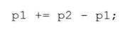

# 练习3.27

假设txt_size是一个无参数的函数，它的返回值是int。请回答下列哪个定义是非法的？为什么？

1. 非法
2. 合法
3. 非法
4. 合法

# 练习3.28

下列数组中元素的值是什么？

* sa：10个空字符串
* ia：10个零
* sa2：10个未定义元素
* ia2：10个未定义元素

# 练习3.29

相比于vector来说，数组有哪些缺点，请举例一些。

缺点：

1. 不能动态扩展长度，浪费内存
2. 没有迭代器，使用不灵活

# 练习3.30

指出下面代码中的索引错误。

迭代所有下标应从0开始，至数组长度-1。

# 练习3.31

编写一段程序，定义一个含有10个int的数组，令每个元素的值就是其下标值。

见源代码文件`solution3_31.cpp`。

# 练习3.32

将上一题刚刚创建的数组拷贝给另外一个数组。利用vector重写程序，实现类似的功能。

见源代码文件`solution3_32.cpp`。

# 练习3.33

对于104页的程序来说，如果不初始化scores将发生什么？

对应分段的计数初始值不是0，而是一个任意值。

# 练习3.34

假定p1和p2指向统一数组中的元素，则下面程序的功能是什么？什么情况下该程序是非法的？

p1移动到p2的位置，不会非法。

# 练习3.35

编写一段程序，利用指针将数组中的元素置为0。

见源代码文件`solution3_35.cpp`。

# 练习3.36

编写一段程序，比较两个数组是否相等。再写一段程序，比较两个vector对象是否相等。

见源代码文件`solution3_36.cpp`。

# 练习3.37

下面的程序是何含义，程序的输出结果是什么？

遍历输出char数组。

# 练习3.38

在本节中我们提到，将两个指针相加不但是非法的，而且也没什么意义。请问为什么两个指针相加没什么意义？

因为就是没意义的，而且相加的结果可能对于数组的索引越界。

# 练习3.39

编写一个程序，比较两个string对象。再编写一段程序，比较两个C风格字符串的内容。

见源代码文件`solution3_39.cpp`。

# 练习3.40

编写一段程序，定义两个字符数组并用字符串字面值初始化它们；接着再定义一个字符串数组放在前两个数组连接后的结果。使用strcpy和strcat把前两个数组的内容拷贝到第三个数组。

见源代码文件`solution3_40.cpp`。

# 练习3.41

编写一段程序，用整形数组初始化一个vector对象。

见源代码文件`solution3_41.cpp`。

# 练习3.42

编写一段程序，将含有整数元素的vector对象拷贝给一个整形数组。

见源代码文件`solution3_42.cpp`。
