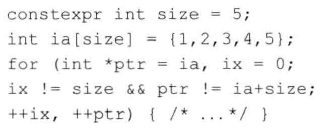
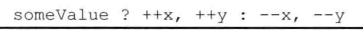

# 练习4.31

本节的程序使用了前置版本的递增运算符和递减运算符，解释为什么要用前置版本而不用后置版本。想要使用后置版本的递增递减运算符需要做哪些改动？使用后置版本重写本节的程序。

对于int类型，使用前置运算符能够减少一点点CPU开销（基本无区别），迭代循环变量建议遵循其他语言的习惯使用后置运算符，改为后置版本不需要改动程序。

对于自定义类型，使用后置会有很大的拷贝开销，不要用。

# 练习4.32

解释下面这个循环的含义。

`ix`和`ptr`功能是重复的，都是判断是否到达数组尾部结束循环，这种代码没有实际意义。

# 练习4.33

根据4.12节中的表说明下面这条表达式的含义。

没有必要讨论这种问题，略。
