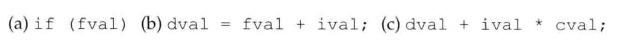
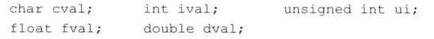
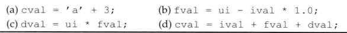
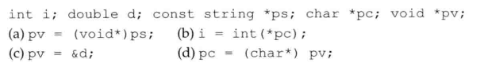
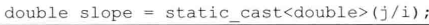

# 练习4.34

根据本节给出的变量定义，说明在下面的表达式中将发生什么样的类型转换：



1. float -> bool
2. int -> float -> double
3. char -> int -> double

# 练习4.35

假设有如下的定义：



请回答在下面的表达式中发生了隐式类型转换吗？如果有，指出来。



1. char -> int -> char
2. int/unsigned int -> double -> float
3. unsigned int -> float -> double
4. int/float -> double -> char

# 练习4.36

假设i是int类型，d是double类型，书写表达式`i*=d`使其执行整数类型的乘法而非浮点类型的乘法。

```
i = i * static_cast<int>(d)
```

# 练习4.37

用命名的强制类型转换改写下列旧式的转换语句。



```
pv = const_cast<void *>ps;
i = static_cast<int>(*pc);
pv = static_cast<void *>(&d);
pc = reinterpret_cast<char *>pv;
```

# 练习4.38

说明下面这条表达式的含义。



`j/i`的结果转换成double，并赋值给slope。
