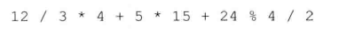

# 练习4.4

在下面的表达式中添加括号，说明其求值的过程及最终的结果。编写程序编译该（不加括号的）表达式并输出其结果验证之前的判断。



91

# 练习4.5

写出下列表达式的求值结果。


1. -86
2. -18
3. 0
4. -2

# 练习4.6

写出一条表达式用于确定一个整数是奇数还是偶数。

```
i % 2 == 0 ? "偶数" : "奇数"
```

# 练习4.7

溢出是何含义？写出三条将导致溢出的表达式。

```
unsigned short i = 65535;
i++;
```

```
unsigned int i = 0;
i--;
```

其余同理。
