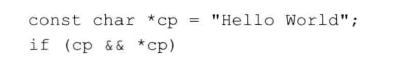

# 练习4.8

说明在逻辑与、逻辑或及相等性运算符中运算对象求职的顺序。

我拒绝记这个顺序，因为大多数人都不清楚，我会加括号以增强代码可读性。

# 练习4.9

解释在下面if语句中条件部分的判断过程。



`cp`不是空指针，且`*cp`不是`\0`。

# 练习4.10

为while循环写一个条件，使其从标准输入中读取整数，遇到42时停止。

见源代码文件`solution4_10.cpp`。

# 练习4.11

书写一条表达式用于测试4个值a、b、c、d的关系，确保a大于b、b大于c、c大于d。

```
a > b && b > c && c > d
```

# 练习4.12

假设i、j和k是三个整数，说明表达式`i!=j<k`的含义。

略，思维正常的人不会这样写的。
