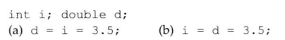
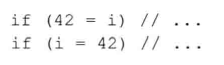
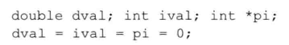
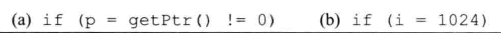

# 练习4.13

在下述语句中，当赋值完成后i和d的值分别是多少？



1. 3 3.0
2. 3 3.5

# 练习4.14

执行下述if语句后将发生什么情况？



1. 不合法，无法为字面值赋值
2. 永远为true

# 练习4.15

下面的赋值是非法的，为什么？应该如何修改？



因为编译器不允许将指针类型转换成整型。

```
dval = 0;
ival = 0;
pi = 0;
```

# 练习4.16

尽管下面的语句合法，但它们实际执行的行为可能和预期并不一样，为什么？应该如何修改？



```
p = getPtr();
if(p)
```

```
if(i == 1024)
```
