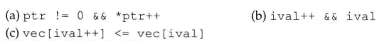

# 练习4.17

说明前置递增运算符和后置递增运算符的区别。

* 前置递增：表达式求值前执行
* 后置递增：表达式求值后执行

# 练习4.18

如果第132页那个输出vector对象元素的while循环使用前置递增运算符，将得到什么结果？

无法输出第一个元素，输出最后一个元素会越界。

# 练习4.19

假设ptr的类型是指向int的指针、vec的类型是vector<int>、ival的类型是int，说明下面的表达式是何含义？如果有表达式不正确，为什么？应该如何修改？

1. 正确，判断ptr是否是空指针，以及其指向是否是0，表达式执行后指向的值加1
2. 判断ival是否是0，然后ival递增
3. 不正确，不能用递增运算符，直接用`ival + 1`
