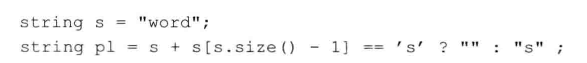

# 练习4.21

编写一段程序，使用条件运算符从vector<int>中找到哪些元素的值是奇数，然后将这些奇数值翻倍。

见源代码文件`solution4_21.cpp`。

# 练习4.22

本节的示例程序将成绩划分成high pass，pass，fail三种，扩展该程序使其进一步将60分到75分之间的成绩设定为low pass。要求程序包含两个版本：一个版本只是用条件运算符，另一个版本使用1个或多个if语句。哪个版本的程序更容易理解呢？为什么？

见源代码文件`solution4_22_1.cpp`和`solution4_22_2.cpp`，稍微修改了下原题目的区间使得取值更合理。

两个都很容易理解，使用`? :`嵌套时，要注意比较结果处理顺序要保持一致，这样代码很整齐简洁，否则可读性很差。

# 练习4.23

因为运算符的优先级问题，下面这条表达式无法通过编译。根据4.12节中的表（第147页）指出它的问题在哪里？应该如何修改？

应在`==`两侧加上括号。

# 练习4.24

本节的示例程序将成绩划分为high pass，pass，fail三种，它的依据是条件运算符满足右结合律。加入条件运算符满足的是左结合律，求值过程将是怎样的？

略。
