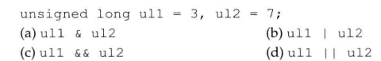

# 练习4.25

如果一台机器上int占32位、char占8位，用的是Latin-1字符集，其中字符'q'的二进制形式是`01110001`，那么表达式`~'q' << 6`的值是什么？

`~'q' = ~00000000000000000000000001110001 = 11111111111111111111111110001110`

负值右移是未定义的结果。

# 练习4.26

在本节关于测验成绩的例子中，如果使用unsigned int作为quiz1的类型会发生什么情况？

如果机器字长较小的时候，位数会不够。

# 练习4.27

下列表达式的结果是什么？

* 3
* 7
* true
* true
