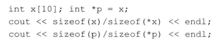
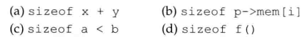

# 练习4.28

编写一段程序，输出每一种内置类型所占空间的大小。

```cpp
#include <iostream>

using namespace std;

int main()
{
	char a = 'a';
	short b = 1;
	int c = 1;
	long d = 1;
	long long e = 1;
	float f = 1.0;
	double g = 1.0;
	long double h = 1.0;

	cout << "char\t" << sizeof(a) << endl;
	cout << "short\t" << sizeof(b) << endl;
	cout << "int\t" << sizeof(c) << endl;
	cout << "long\t" << sizeof(d) << endl;
	cout << "long long\t" << sizeof(e) << endl;
	cout << "float\t" << sizeof(f) << endl;
	cout << "double\t" << sizeof(g) << endl;
	cout << "long double\t" << sizeof(h) << endl;

	return 0;
}
```

```
char    1
short   2
int     4
long    4
long long       8
float   4
double  8
long double     12
```

# 练习4.29

推断下面代码的输出结果并说明理由。实际运行这段程序，结果和你想象的一样吗？如果不一样，为什么？



输出10 1（用MinGW编译为32位程序，Windows系统）

# 练习4.30

根据4.12节中的表，在下述表达式的适当位置加上括号，使得加上括号之后表达式的含义与原来的含义相同。



```
(sizeof x) + y
sizeof (p->mem[i])
(sizeof a) < b
sizeof (f())
```
