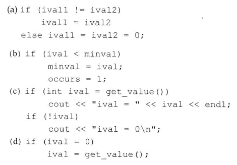

# 练习5.5

写一段自己的程序，使用`if else`语句实现把数字成绩转换成字母成绩的要求。

见源代码文件`solution5_5.cpp`。

# 练习5.6

改写上一题的程序，使用条件运算符代替`if else`语句。

见源代码文件`solution5_6.cpp`。

# 练习5.7

改正下列代码段中的错误。



1. `ival1 = ival2;`，添加一个分号
2. `if`内有两条语句，必须加上大括号
3. 第二个`if`无法访问`ival`，应将其提到上一级语句块
4. `if`中应改为`==`

# 练习5.8

什么是“悬垂else”？C++语言是如何处理else子句的？

C++编译器处理`if`和`else`匹配的问题，`else`只和同一级最近的`if`匹配。

# 练习5.9

编写一段程序，使用一系列`if`语句统计从`cin`读入的文本中有多少元音字母。

见源代码文件`solution5_9.cpp`。

# 练习5.10

我们之前实现的统计元音字母的程序存在一个问题：如果元音字母以大写形式出现，不会被统计在内。编写一段程序，既统计元音字母的小写形式，也统计大写形式，也就是说，新程序遇到`a`和`A`都应该递增`aCnt`，以此类推。

怎么可能？？？你觉得我会想不到大写字母也要统计嘛？？？

# 练习5.11

修改统计元音字母的程序，使其业能统计空格、制表符和换行符的数量。

修改此变量即可：
```cpp
string target = "aeiouAEIOU";
```

# 练习5.12

修改统计元音字母的程序，使其能统计以下含有两个字符的字符序列的数量：`ff`、`fl`、`fi`。

这个不建议使用`if`了，应该使用正则表达式。

# 练习5.13

下面显示的每个程序都含有一个常见的变成错误，指出错误在哪里，然后修改它们。

1. 缺少`break`
2. ix未定义
3. case语法使用错误
4. case条件必须是常量表达式
