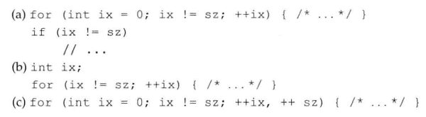
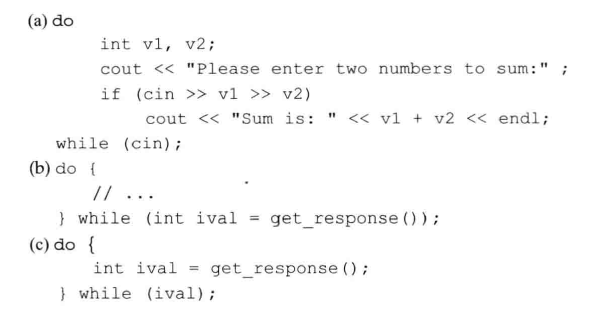

# 练习5.14

编写一段程序，从标准输入中读取若干string对象并查找连续重复出现的单词。

见源代码文件`solution5_14.cpp`。

# 练习5.15

说明下列循环的含义并改正其中的错误。

1. 将`ix`提到外层
2. `ix`未初始化
3. `for`判断不可能结束

# 练习5.16

while循环特别适用于那种条件保持不变、反复执行操作的情况，例如，当未达到文件末尾时不断读取下一个值。for循环则更像是按步骤迭代，它的索引值在某个范围内依次变化。根据每种循环的习惯用法各自编写一段程序，然后分别用另一种循环改写。如果只能使用一种循环，你倾向于使用哪种呢？为什么？

见源代码文件`solution5_16.cpp`，求`[0, 3]`区间整数的和。

我不倾向于任何一种，具体情况具体分析。

# 练习5.17

假设有两个包含整数的vector对象，编写一段程序，检验其中一个vector对象是否是另一个的前缀。

见源代码文件`solution5_17.cpp`。

# 练习5.18

说明下列循环的含义并改正其中的错误。

1. 多行语句缺少大括号
2. do语句块取不到ival
3. ival未定义

# 练习5.19

编写一段程序，使用do while循环重复的执行下述任务，首先提示用户输入两个string对象，然后挑出较短的那个并输出它。

见源代码文件`solution5_19.cpp`。
