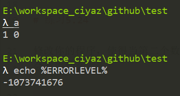

# 练习5.23

编写一段程序，从标准输入读取两个整数，输出第一个数除以第二个数的结果。

```cpp
#include <iostream>

using namespace std;

int main()
{
	int i, j;
	cin >> i >> j;
	cout << i / j << endl;
	return 0;
}
```

# 练习5.24

修改你的程序，使得当第二个数是0时抛出异常。先不要设定catch子句，运行程序并真的为除数输入0，看看会发生什么？



# 练习5.25

修改上一题的程序，使用try语句块去捕获异常。catch子句应该为用户输出一条提示信息，询问其是否输入新数并重新执行try语句块的内容。

这个程序是无法实现的，因为C++并没有像Java一样，定义除以0的标准异常，这是历史原因造成的，除以0是一个未定义行为，对于可能除以0的情况，一定要手动判断。
