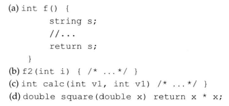

# 练习6.1

实参和形参的区别是什么？

实参是调用者传给函数的，形参是定义函数时使用的。

# 练习6.2

支出下列函数哪个有错误，为什么？应该如何修改这些错误呢？



1. 不能返回一个函数局部变量
2. 未定义函数返回值
3. 两个形参名不能相同
4. 缺少大括号

# 练习6.3

编写你自己的fact函数，上机检查是否正确。

见源代码文件`solution6_3.cpp`。

# 练习6.4

编写一个与用户交互的函数，要求用户输入一个数字，计算生成该数字的阶乘。在main函数中调用该函数。

见源代码文件`solution6_4.cpp`。

# 练习6.5

编写一个函数输出其实参的绝对值。

```cpp
int abs(int i)
{
  return i < 0 ? -i : i;
}
```

# 练习6.6

说明形参、局部变量以及局部静态变量的区别。编写一个函数，同时用到这三种形式。

* 形参：用于代表这个执行流程的参数
* 局部变量：函数栈内创建的一个数据，函数返回时栈不再有效，该位置的数据就是未定义的
* 局部静态变量：虽然在局部定义，但是其存储在静态区，所以一直有效

```cpp
void foo(int i)
{
  int j = i;
  static int k = 0;
  return k;
}
```

# 练习6.7

编写一个函数，当它第一次被调用时返回0，以后每次被调用返回值加1。

```cpp
int foo()
{
	static int i = 0;
	i += 1;
	return i;
}
```

注：这道题考察了函数内`static`变量的用法，但是这种用法乍一看就很不好，最好不要用它。

# 练习6.8

编写一个名为`Chapter6.h`的头文件，令其包含6.1节练习中的函数声明。

见源代码文件`solution6_8/Chapter6.h`。

# 练习6.9

编写你自己的`fact.cc`和`factMain.cc`，这两个文件都应该包含上一小节的练习中编写的`Chapter6.h`头文件。通过这些文件，理解你的编译器是如何支持分离式编译的。

编译命令：
```
g++ main.cpp func.cpp
```

见源代码文件夹`solution6_8`。
