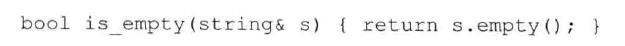
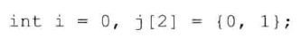
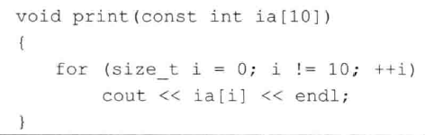
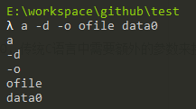

# 练习6.10

编写一个函数，使用指针形参交换两个整数的值。在代码中调用该函数并输出交换后的结果，以此验证函数的正确性。

见源代码文件`solution6_10.cpp`。

# 练习6.11

编写并验证你自己的reset函数，使其作用于引用类型的参数。

```cpp
void reset(int &i)
{
	i = 0;
}
```

# 练习6.12

改写6.2.1节中练习6.10的程序，使用引用而非指针交换两个整数的值。你觉得哪种方法更易于使用呢？为什么？

见源代码文件`solution6_12.cpp`。两种方法都很好，习惯用C语言更喜欢指针，但是引用也不难理解。

# 练习6.13

假设T是某种类型的名字，说明以下两个函数声明的区别：一个是`void f(T)`，另一个是`void f(&T)`。

第一个是值传递，第二个是引用传递。

# 练习6.14

举一个形参应该是引用类型的例子，再举一个形参不能是引用类型的例子。

1. 例如交换两个数
2. 例如函数需要拷贝后修改一个对象的值

# 练习6.15

说明find_char函数中的三个形参为什么是现在的类型，特别说明为什么s是常量引用而occurs是普通引用？为什么s和occurs是引用类型而c不是？如果令s是普通引用会发生什么情况？如果令occurs是常量引用会发生什么情况？

1. s定义为常量引用可以防止函数体内误将其内容改变。
2. s使用引用传递能够减少拷贝开销，occurs需要在函数体内被改变。
3. 如果令s是普通引用，可能产生s被意外改变的bug。
4. 如果令occurs是常量引用，occurs值无法改变，会报错。

# 练习6.16

下面的这个函数虽然合法，但是不算特别有用。指出它的局限性并设法改善。



函数未改变参数的值，因此应在函数参数上加上const修饰符。

# 练习6.17

编写一个函数，判断string对象中是否包含有大写字母。编写另一个函数，把string对象全都改成小写形式。在这两个函数中，你使用的形参类型相同吗？为什么？

见源代码文件`solution6_17.cpp`。

形参不同，第一个函数不改变字符串本身，因此使用了`const`修饰，而第二个会改变字符串。

# 练习6.18

为下面的函数编写函数声明，从给定的名字中推测函数具备的功能。

* 名为compare的函数，返回布尔值，两个参数都是`matrix`类的引用。
* 名为change_val的函数，返回`vector<int>`的迭代器，有两个参数：一个是`int`，另一个是`vector<int>`的迭代器。

```cpp
bool compare(const matrix &m1, const matrix &m2);
vector<int>::iterator change_val(int, vector<int>::iterator);
```

# 练习6.19

假定有如下声明，判断哪个调用合法、哪个调用不合法。对于不合法的函数调用，说明原因。

1. 不合法，参数不匹配
2. 合法
3. 合法
4. 不合法，参数不匹配

# 练习6.20

引用形参什么时候应该是常量引用？如果形参应该是常量引用，而我们将其设为了普通引用，会发生什么情况？

不改变参数值时，应该设置为常量引用，如果未设置，虽然不会出错，但函数的使用者可能会误以为这个函数可能改变参数的值。

# 练习6.21

编写一个函数，令其接受两个参数：一个是int型的数，另一个是int指针。函数比较int的值和指针所指的值，返回较大的那个。在该函数中指针的类型应该是什么？

见源代码文件`solution6_21.cpp`。

# 练习6.22

编写一个函数，令其交换两个int指针。

见源代码文件`solution6_22.cpp`。

# 练习6.23

参考本节介绍的几个print函数，根据理解编写你自己的版本，依次调用每个函数使其输入下面定义的i和j：



见源代码文件`solution6_23.cpp`。

# 练习6.24

描述下面这个函数的行为。如果代码中存在问题，请指出并改正。



接收一个大小为10的数组，打印其中的元素，问题是传入的数组大小不一定是10，传统C语言中需要额外的参数来接收数组的大小，C++中，更好的方式是传递数组的引用参数`int (&arr)[10]`，这样就能得知数组的大小了。

# 练习6.25

编写一个main函数，令其接受两个实参。把实参的内容连接成一个string对象并输出出来。

见源代码文件`solution6_25.cpp`。

# 练习6.26

编写一个程序，使其接受本节所示的选项；输出传递给main函数的实参的内容。

见源代码文件`solution6_26.cpp`。



# 练习6.27

编写一个函数，它的参数是`initializer_list<int>`类型的对象，函数的功能是计算列表中所有元素的和。

见源代码文件`solution6_27.cpp`。

# 练习6.28

在`error_msg`函数的第二个版本中包含ErrCode类型的参数，其中循环内的elem是什么类型？

`const string &`类型。

# 练习6.29

在范围for循环中使用`initializer_list`对象时，应该将循环控制变量声明成引用了类型吗？为什么？

如果拷贝开销很大，可以声明为引用类型，但它必须是指向静态常量的引用。
