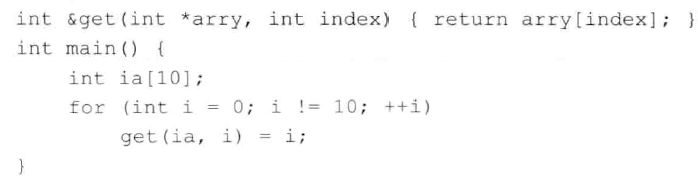

# 练习6.30

编译第200页的`str_subrange`函数，看看你的编译器是如何处理函数中的错误的。

编译器明确的提示了我们，函数声明中的返回值是`bool`，但我们`return`的时候，什么都没返回。

# 练习6.31

什么情况下返回的引用无效？什么情况下返回常量的引用无效？

引用指向的数据在函数栈上，但是函数返回，该栈销毁，该段数据就变为未定义了。

# 练习6.32

下面的函数合法吗？如果合法，说明其功能；如果不合法，修改其中的错误并解释其原因。



合法，返回一个数组中指定索引位置的值。

# 练习6.33

编写一个递归函数，输出vector对象的内容。

见源代码文件`solution6_33.cpp`。

# 练习6.34

如果factorial函数的停止条件如下所示，将发生什么情况？

```
if (val != 0)
```

如果输入值是负数，递归就永远无法停止了。

# 练习6.35

在调用factorial函数时，为什么我们传入的值是val-1而非val--？

我们不希望在当前函数栈中改变val。

# 练习6.36

编写一个函数声明，使其返回数组的引用并且该数组包含10个string对象。不要使用尾置返回类型、decltype或者类型别名。

```cpp
string (&func())[10]
```

# 练习6.37

为上一题的函数再写三个声明，一个使用类型别名，另一个使用尾置返回类型，最后一个使用decltype关键字。你觉得那种形式最好，为什么？

```cpp
typedef string strArr[10];
strArr &func();
```

```cpp
auto func() -> string(&)[10];
```

```cpp
string strArr[10];
decltype(strArr) &func();
```

前两种比较好。

# 练习6.38

修改arrPtr函数，使其返回数组的引用。

```
auto func(int i) -> int(&)[10];
```
