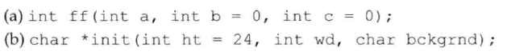
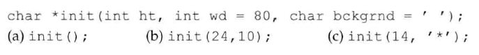
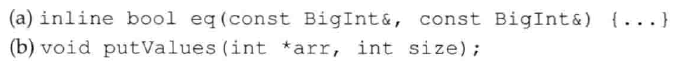
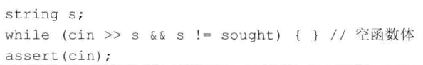

# 练习6.40

下面哪个声明是错误的？为什么？



2错误。声明一个默认参数，后面的也必须是默认参数。

# 练习6.41

下面的哪个调用时非法的？为什么？哪个调用虽然合法但显然与程序员的初衷不符？为什么？



1. 非法，少传了参数
2. 合法
3. 错误，由于隐式类型转换，编译器不会报错，但是wd会被设置为`*`对应的int值

# 练习6.42

给`make_plural`函数的第二个形参赋予默认实参`s`，利用新版本的函数输出单词success和failure的单数和复数形式。

```cpp
string make_plural(size_t ctr, const string &word, const string &ending = "s");
```

# 练习6.43

你会把下面的哪个声明和定义放在头文件中？哪个放在源文件中？为什么？



声明都放在头文件中，定义根据具体情况决定。

# 练习6.44

将2.2.6节的isShorter函数改写成内联函数。

函数声明前加`inline`即可。

# 练习6.45

回顾在前面的练习中你编写的那些函数，它们应该是内联函数吗？如果是，将它们改写成内联函数；如果不是，说明原因。

略。

# 练习6.46

能把isShorter函数定义成constexpr函数吗？如果能，将它改写成constexpr函数；如果不能，说明原因。

不能，返回值不是基本类型。

# 练习6.47

改写6.3.2节练习中使用递归输出vector内容的程序，使其有条件地输出与执行过程有关的信息。例如，每次调用时输出vector对象的大小。分别在打开和关闭调试器的情况下编译并执行这个程序。

见源代码文件`solution6_47.cpp`。

# 练习6.48

说明下面这个循环的含义，它对assert的使用合理吗？



显然，不合理。
