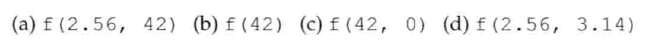
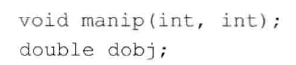
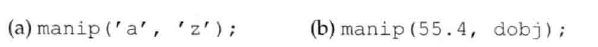
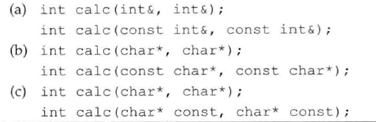
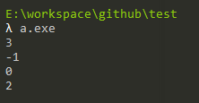

# 练习6.49

什么是候选函数？什么是可行函数？

* 候选函数：与被调用的函数同名，声明在调用点可见。
* 可行函数：形参数量与本次调用提供的实参数量相等，每个实参的类型与对应的形参类型相同（或者能转换成形参的类型）

# 练习6.50

已知有第217页对函数f的声明，对于下面的每一个调用列出可行函数。其中哪个函数时最佳匹配？如果调用不合法，是因为没有可匹配的函数还是因为调用具有二义性？



1. 无匹配的函数
2. `void f(int)`
3. `void f(int int)`
4. `void f(double double)`

# 练习6.51

略

# 练习6.52

已知有如下声明：



请指出下列调用中每个类型转换的等级。



1. 类型提升
2. 算数类型转换

# 练习6.53

请说明下列每组声明中的第二条语句会产生什么影响，并指出哪些不合法。



1. 合法
2. 合法
3. 不合法

# 练习6.54

编写函数声明，令其接受两个int形参并且返回类型也是int；然后声明一个vector对象，令其元素是指向该函数的指针。

```cpp
int func(int i, int j);
vector<int (*)(int, int)> vector;
```

# 练习6.55

编写4个函数，分别对两个int值执行加减乘除运算；在上一题创建的vector对象中保存指向这些函数的指针。

见源代码文件`solution6_55.cpp`。

# 练习6.66

调用上述vector对象中的每个元素并输出其结果。


