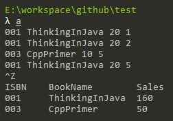
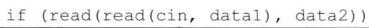

# 练习7.1

使用2.6.1节练习定义的Sales_data类为1.6节的交易处理程序编写一个新版本。

见源代码`solution7_1/solution7_1.cpp`，之前我定义的`SalesData`虽然更符合实际情况但是比较复杂，这里重新定义一个简单的。



# 练习7.2

曾在2.6.2节练习中编写了一个Sales_data类，请向这个类添加combine和isbn成员。

见源代码`solution7_2/salesdata.cpp`。

# 练习7.3

修改7.1.1节的交易处理程序，令其使用这些成员。

由于我的代码结构恰好用不上这两个函数，所以该替略，isbn和combine函数的测试见`solution7_2/main.cpp`。

# 练习7.4

编写一个名为Person的类，使其表示人员的姓名和住址。使用string对象存放这些元素，接下来的练习将不断充实这个类的其它特征。

```cpp
struct Person
{
  std::string name;
  std::string address;
};
```

# 练习7.5

在你的Person类中提供一些操作使其能够返回姓名和住址。这些函数是否应该是const的呢？解释原因。

```cpp
struct Person
{
  std::string name;
  std::string address;

  std::string getName() const;
  std::string getAddress() const;
};

std::string Person::getName() const
{
	return this->name;
}

std::string Person::getAddress() const
{
	return this->address;
}
```

应该是const的，因为是只读的，声明为const成员函数就无法修改该类的数据成员。

# 练习7.6

对于函数add、read和print，定义你自己的版本。

见源代码`solution7_6/salesdata.h`和`solution7_6/salesdata.cpp`。

# 练习7.7

使用这些新函数重写7.1.2节练习中的交易处理程序。

见源代码`solution7_6/solution7_7.cpp`。

# 练习7.8

为什么read函数将其Sales_data参数定义成普通的引用，而print将其参数定义成常量引用？

读取需要修改`Sales_data`的值，而打印不需要，因此定义为常量引用。

# 练习7.9

对于7.1.2节练习中的代码，添加读取和打印Person对象的操作。

见源代码`solution7_9`。

# 练习7.10

在下面这条if语句中，条件部分的作用是什么？



读取标准输入到data1，再读取到data2。

# 练习7.11

在你的Sales_data类中添加构造函数，然后编写一段程序令其用到每个构造函数。

见源代码文件`solution7_11`。

# 练习7.12

把只接受一个istream作为参数的构造函数定义到类的内部。

见源代码文件`solution7_12`。

# 练习7.13

使用istream构造函数重写第229页的程序。

见源代码文件`solution7_12/solution7_13.cpp`。

注意：该程序还是有个问题，最后会多读取一次标准输入，而造成初始化了一个错误的`SalesData`对象，但是我们没法避免这个问题，因为构造函数是没有返回值的。也就是说，如果通过`std::istream`作为构造函数参数实例化对象，就没法避免实例化错误的对象，这个程序是不能这样写的。

# 练习7.14

编写一个构造函数，令其用我们提供的类内初始值显式地初始化成员。

见源代码文件`solution7_14`。

# 练习7.15

为你的Person类添加正确的构造函数。

见源代码文件`solution7_15`。
