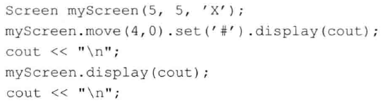
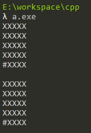
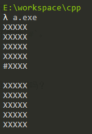

# 练习7.23

编写你自己的Screen类。

见源代码文件`solution7_23`。

# 练习7.24

给你的Screen类添加三个构造函数：一个默认构造函数；另一个构造函数接受宽和高的值，然后将contents初始化成给定数量的空白；第三个构造函数接受宽和高的值以及一个字符，该字符作为初始化之后屏幕的内容。

见源代码文件`solution7_23`。

# 练习7.25

Screen能安全地依赖于拷贝和赋值操作的默认版本吗？如果能，为什么？如果不能，为什么？

能，Screen中的成员变量都是基本类型和string类型，而不会出现因为分配堆内存造成的深浅拷贝问题，因此Screen能够安全的进行这些操作。

# 练习7.26

将Sales_data::avg_price定义成内联函数。

略。

# 练习7.27

给你自己的Screen类添加move、set和display函数，通过执行下面的代码检查你的类是否正确。



见源代码文件`solution7_27`。

输出结果：



# 练习7.28

如果move、set和display函数的返回值类型不是`Screen&`而是`Screen`，则在上一个练习中会发生什么情况？

不返回引用会发生对象的拷贝，因此第二个输出的还是`Screen myScreen(5, 5, 'X')`实例化的对象本身，不包含`#`。

# 练习7.29

修改你的Screen类，令move、set和display函数返回Screen并检查程序的运行结果，在上一个练习中饭你的推测正确吗？



推测是正确的。

# 练习7.30

通过this指针使用成员的做法虽然合法，但是有点多余。讨论显示地使用指针访问成员的优缺点。

* 优点：可以方便的调出IDE的自动提示，业务逻辑可读性强
* 缺点：如果有大量的数学运算，大量的`this`十分多余

# 练习7.31

定义一对类X和Y，其中X包含一个指向Y的指针，而Y包含一个类型为X的对象。

```cpp

class X;
class Y;

class X
{
  Y *y;
};

class Y
{
  X x;
};
```
